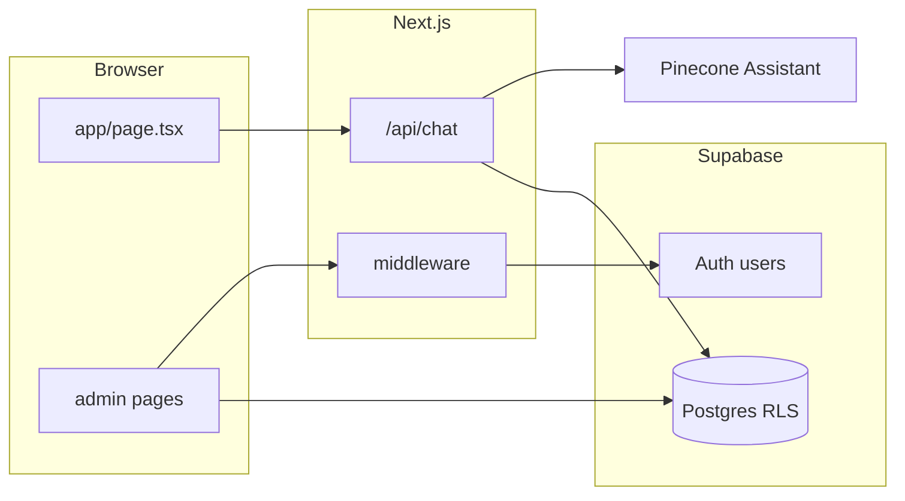

# لوحة إدارة كاملة مع Supabase

## الوضع الحالي

- التطبيق [Next.js 15](package.json) مع واجهة محادثة في [`app/page.tsx`](app/page.tsx) تتصل بـ [`app/api/chat/route.ts`](app/api/chat/route.ts) (Pinecone فقط؛ لا قاعدة بيانات للمحادثة).
- يوجد مسار [`app/admin/page.tsx`](app/admin/page.tsx) لكنه يحفظ محتوى الدليل في **`localStorage`** فقط، بينما يوجد API منفصل [`app/api/guide-content/route.ts`](app/api/guide-content/route.ts) يعتمد على ملف [`utils/guide-loader.ts`](utils/guide-loader.ts) (`data/guide-content.txt`) — **غير موحّد** مع واجهة الإدارة.
- لا يوجد `middleware` ولا حزمة Supabase في المشروع.

**ملاحظة مهمة للذكاء الاصطناعي:** إجابات المستخدم ما زالت من Pinecone. Supabase ستكون **مصدر إدارة للمحتوى والإحصائيات**؛ تحديث قاعدة معرفة Pinecone يبقى عملية منفصلة (يدوية أو سكربت) عند تغيير نص الدليل.

---

## 1) إعداد Supabase (يدوياً في لوحة Supabase)

- إنشاء مشروع (أو استخدام الموجود)، تفعيل **Email + Password**، وتعطيل **التسجيل العام** (Sign ups) إن أردتم حسابات إدارية فقط تُنشأ من لوحة Supabase أو عبر دعوة.
- إضافة متغيرات البيئة للمستودع (مثلاً `.env.local` — غير مُتعقّب في git عادةً):
  - `NEXT_PUBLIC_SUPABASE_URL`
  - `NEXT_PUBLIC_SUPABASE_ANON_KEY`
  - `SUPABASE_SERVICE_ROLE_KEY` (للخادم فقط — لا تُعرَّض للمتصفح)

---

## 2) مخطط قاعدة البيانات والأمان (SQL migrations)

إضافة مجلد مثل [`supabase/migrations/`](supabase/migrations/) مع ملف SQL واحد على الأقل يتضمن:

| الجدول | الغرض |
|--------|--------|
| `public.profiles` | `id` = `auth.users.id`, `email`, `role` (`admin` \| `user`) — يُحدَّد من يدخل الإدارة |
| `public.guide_snapshots` | صف واحد «نشط» أو عدة إصدارات: `id`, `body` (`text`), `is_published`, `updated_at`, `updated_by` |
| `public.site_settings` | مفتاح/قيمة (`key`, `value` json أو text) لاحقاً (روابط، نصوص، إلخ) |
| `public.chat_analytics_events` | تتبع خفيف: `id`, `created_at`, `session_id` (uuid من العميل)، `user_excerpt` (محدود الطول، اختياري عبر env)، `assistant_excerpt` أو طول الرد فقط، `ok`, `latency_ms` |

**RLS (مبدأي):**

- `profiles`: المستخدم يقرأ صفه؛ تحديث `role` يكون عبر **Service Role** من سكربت/لوحة فقط (لا تسمح للعميل بتعيين نفسه أدمن).
- `guide_snapshots` / `site_settings`: **قراءة/كتابة للمستخدم المصادق الذي `role = admin`** (باستخدام سياسات `exists (select 1 from profiles ...)`).
- `chat_analytics_events`: **INSERT** للعميل المجهول أو للمستخدم (حسب ما تختارون — عادة **INSERT من anon** مع قيود: لا SELECT للعامة)، **SELECT** لـ `admin` فقط لصفحة الإحصائيات.

**محفز (Trigger):** عند إنشاء مستخدم في `auth.users`، إدراج صف في `profiles` بـ `role` افتراضي `'user'`؛ ترقية الأدمن يدوياً في SQL مرة واحدة لكل بريد إداري.

---

## 3) تكامل Next.js + Supabase

- تثبيت `@supabase/supabase-js` و `@supabase/ssr`.
- إضافة عناوين مساعدة (نمط App Router):
  - [`lib/supabase/client.ts`](lib/supabase/client.ts) — عميل المتصفح
  - [`lib/supabase/server.ts`](lib/supabase/server.ts) — `createServerClient` مع cookies
  - [`lib/supabase/middleware.ts`](lib/supabase/middleware.ts) — تحديث الجلسة (حسب توثيق Supabase لـ Next.js)
- إضافة [`middleware.ts`](middleware.ts) في جذر المشروع:
  - استدعاء تحديث الجلسة لكل الطلبات (أو المسارات ذات الصلة).
  - حماية ` /admin` **ما عدا** `/admin/login` ومسارات الأصول الثابتة: إن لا توجد جلسة أو الملف الشخصي ليس `admin` → إعادة توجيه إلى `/admin/login`.

---

## 4) صفحات لوحة الإدارة (RTL + shadcn موجود)

توسيع [`app/admin/layout.tsx`](app/admin/layout.tsx):

- شريط جانبي (يمكن الاستفادة من [`components/ui/sidebar.tsx`](components/ui/sidebar.tsx)) مع روابط: **الرئيسية**، **محتوى الدليل**، **الإحصائيات**، **الإعدادات** (الإعدادات تربط `site_settings` لاحقاً أو تبقى placeholder).

صفحات مقترحة:

| المسار | الوظيفة |
|--------|---------|
| `/admin/login` | نموذج بريد + كلمة مرور + `signInWithPassword` |
| `/admin` | بطاقات ملخص: آخر تحديث للدليل، عدد الأحداث اليوم/الأسبوع، نسبة النجاح |
| `/admin/guide` | محرر النص (نفس فكرة الصفحة الحالية) يقرأ/يكتب عبر Supabase (من العميل بـ RLS أو عبر Route Handler يتحقق من الجلسة) |
| `/admin/analytics` | جدول مع تصفية بالتاريخ + تصدير CSV بسيط (اختياري) |

إزالة اعتماد **`localStorage`** من محرر الدليل واستبداله بـ `load`/`save` من Supabase.

---

## 5) توحيد مصدر محتوى الدليل (اختياري لكن موصى به)

- تحديث [`utils/guide-loader.ts`](utils/guide-loader.ts): `loadGuideContent()` يحاول جلب الصف **المنشور** من Supabase (باستخدام Service Role في سياق الخادم فقط لتجنب تعقيد RLS للقراءة العامة إن لم تُعرَض للزوار)، مع **fallback** إلى الملف الحالي إن لم تُضبط المتغيرات أو الجدول فارغ.
- تحديث [`app/api/guide-content/route.ts`](app/api/guide-content/route.ts): للـ **POST** يتطلب جلسة أدمن (تحقق من `profiles.role`) بدلاً من الكتابة المجهولة على الملف إن أردتم إيقاف الكتابة على القرص في الإنتاج.

(المحادثة الحالية لا تستدعي `guide-content` في الواجهة؛ هذا يجهّز أي استخدام مستقبلي أو سكربتات مثل [`utils/embeddings.ts`](utils/embeddings.ts).)

---

## 6) الإحصائيات من المحادثة

- من [`app/api/chat/route.ts`](app/api/chat/route.ts): بعد بناء الرد الناجح (وفي حالة الخطأ إن رغبت)، إدراج صف في `chat_analytics_events` باستخدام **Service Role** من الخادم (لا تعتمد على anon لكتابة حساسة)، دون إبطاء المستخدم: تشغيل الإدراج بشكل غير معيق (`void ...catch`) أو `after()` إن كان متاحاً في إعدادكم.
- من [`app/page.tsx`](app/page.tsx): توليد/الاحتفاظ بـ `session_id` في `sessionStorage` وإرساله مع طلب المحادثة (حقل إضافي في body) لربط الأحداث بجلسة مجهولة.

**خصوصية:** الاكتفاء بمقتطفات قصيرة جداً (مثلاً 120 حرفاً) أو بـ أطوال فقط، يُضبط عبر `NEXT_PUBLIC_ANALYTICS_CAPTURE_EXCERPT=true/false` لتلبية سياسة المدرسة.

---

## 7) التسليم والتحقق

- تشغيل migration على مشروع Supabase، إنشاء مستخدم أدمن، تعيين `profiles.role = 'admin'`.
- اختبار محلياً: تسجيل الدخول، حفظ الدليل، إجراء محادثة والتأكد من ظهور الصف في الإحصائيات.
- توثيق مختصر في README أو تعليق على المتغيرات (فقط إن رغبت المستخدم لاحقاً؛ يمكن تجنب ملفات markdown إن لم يُطلب).

